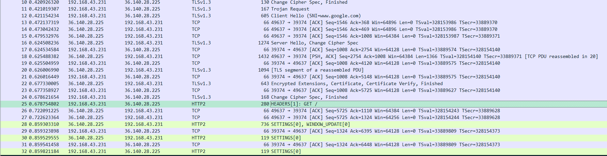
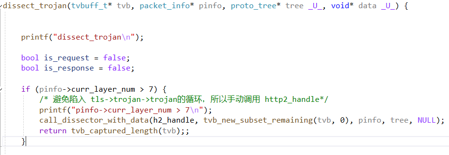
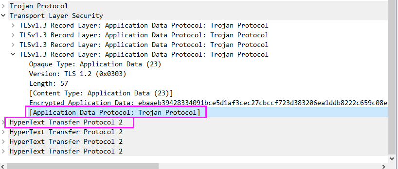

## 目前效果

> 代码是demo，写得很乱，先push一版

## todo:

### 1. 陷入trojan循环

使用 `    pinfo->ptype = PT_NONE; `  代码生效后，tls->trojan->trojan 而不是 tls->trojan->http2, 所以后续手动调用了http2的dissector

### 2. trojan request 

`dissect_trojan_request` 函数中`hf_trojan_dst_addr`，`hf_trojan_dst_port`还未做解析树。

实现思路：通过两个`CRLF`来定位：`| CRLF | dst_addr | CRLF | dst_port |`

### 3. 解析树显示问题

如下图，显示解码为`Trojan Protocol`但实际调用了`HTTP2_dissector`，应该与本小节`问题1`相关。

 

