## 2025-3-19

#### 源码修改

`epan\dissectors\packet-http2.c`

注释掉下面的第一行

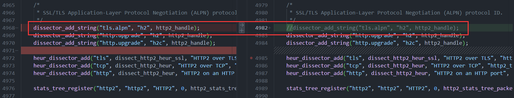

下面代码是为了嵌套`tls` 后，不影响HTTP2的流追踪(有效 但不多)

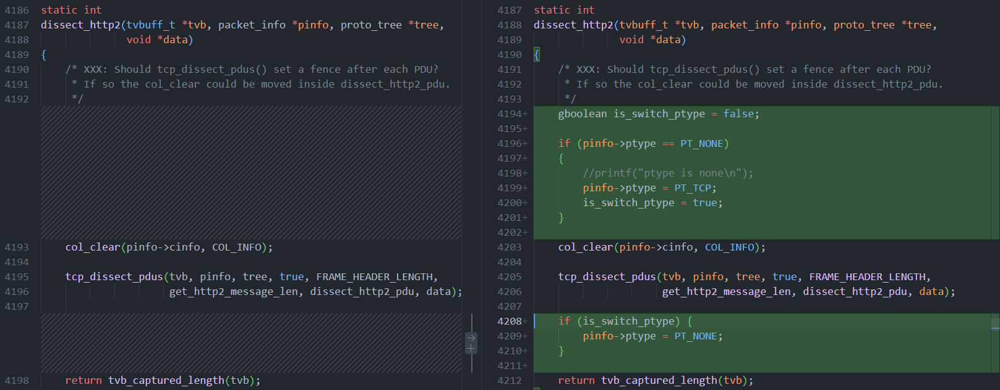

`epan\dissectors\packet-tls-utils.h`

因为`trojan`解密用了原生的`tls` 所以在原生`tls`解密参数中加了一个`trojan`秘钥的文件路径

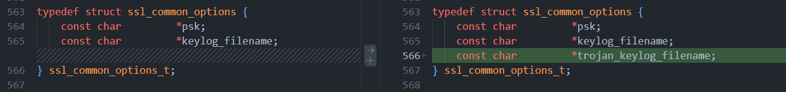

这里代码加了`GUI`中设置`trojan`秘钥文件路径

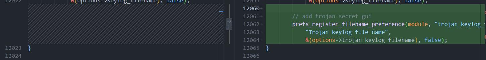

效果：

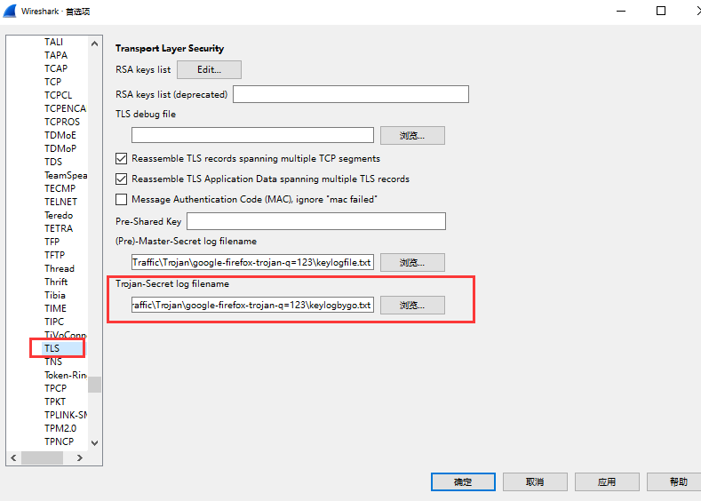

`epan\dissectors\packet-tls.c`

在每次加载`tls`的秘钥文件路径时，都强制再调用一次加载`trojan`秘钥文件路径，总共修改了9处。

```c
ssl_load_keyfile(ssl_options.keylog_filename, &ssl_keylog_file, &ssl_master_key_map);
// load trojan keylog
ssl_load_keyfile(ssl_options.trojan_keylog_filename, &ssl_keylog_file, &ssl_master_key_map);
```


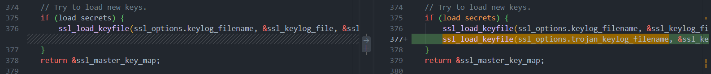

# 2024-10-18 Trojan V2.1

## 第一步：修改packet-http2.c

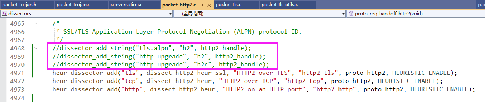

## 存在的问题
### 1. 解析树和流量包不一致
`#1535`数据包，后面的`Info`应该为`Trojan Request` 而不是 `Continuation`,应该和`HTTP.c`中的`dissector_add_string("tls.alpn", "http/1.1", http_tls_handle);` 有关

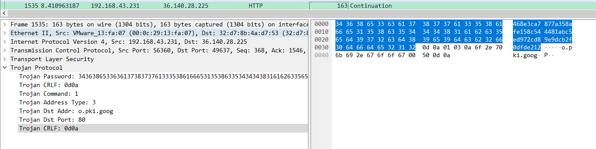

> 似乎可以用这个解决，但还是有说不清楚的 bug。设置了下面代码，所有的tls都要被解析为 trojan, 且不经过 trojan_tls_heur，所以一些不是两层tls加密的数据不能正常显示。如何在trojan_dissect中写一段代码实现不是trojan数据时，就正常调用别的解析器，但是还有一点点问题，只解析了第一层，不会深入嵌套解析？
```c
struct tlsinfo* tlsinfo = (struct tlsinfo*)data;
*(tlsinfo->app_handle) = trojan_handle;
```
### 2.  tlsinfo->app_handle 带来的问题
`#1528`是`tls`, 和`1529`是 `Teassembled TLS` ，设置`trojan_handle`之后，强行调用`dissect_trojan`，就不会自动组合了，不设置`trojan_handle`，它会自动组合。

下图为不设置`trojan_handle`
`#1528`解析成了`tls`

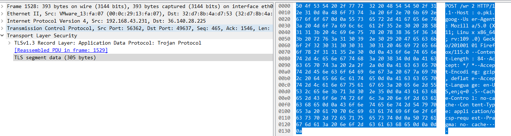

`#1529` 解析成了 `http + ocsp`

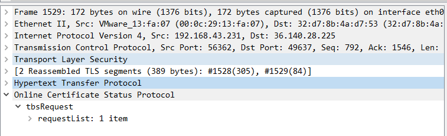

下图为设置了`trojan_handle`

`#1528`解析成了 `http`

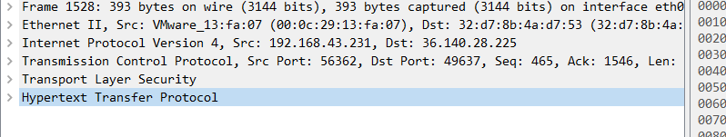

`#1529`解析成了`http`

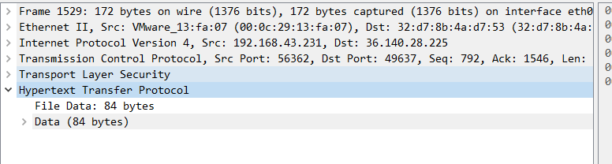

### 3. 解析数据包默认两个轮回

打印了调用`dissector`的日志，发现进行了两轮的`dissector`，以`#1535`数据包为例，**且过程不一样**

> conversation = find_or_create_conversation(pinfo); 对下面的结果不影响

第一轮，`#1535`调用了`trojan` 

```c
【Info Frame number 1516】：dissect_trojan_heur_tls, 4bytes: POST
【Info Frame number 1516】：dissect_trojan_heur_tls return false
dissect_http_heur_tls -- conv_data ,num: 1517
【Info Frame number 1527】：dissect_trojan_heur_tls, 4bytes: 468e
dissect_trojan  pinfo->Frame number: 1527, 4bytes: 468e
--dissect_trojan_request
----pinfo->curr_layer_num = 7
【Info Frame number 1528】：dissect_trojan_heur_tls, 4bytes: POST
【Info Frame number 1528】：dissect_trojan_heur_tls return false
dissect_http_heur_tls -- conv_data ,num: 1529
【Info Frame number 1535】：dissect_trojan_heur_tls, 4bytes: 468e
dissect_trojan  pinfo->Frame number: 1535, 4bytes: 468e
--dissect_trojan_request
----pinfo->curr_layer_num = 7
```

第二轮，`#1535`调用了`http` 

```c
【Info Frame number 1517】：dissect_trojan_heur_tls, 4bytes: POST
【Info Frame number 1517】：dissect_trojan_heur_tls return false
dissect_http_heur_tls -- conv_data ,num: 1517
dissect_http_heur_tls -- conv_data ,num: 1527
dissect_http_heur_tls -- conv_data ,num: 1529
dissect_http_heur_tls -- conv_data ,num: 1535
dissect_http_heur_tls -- conv_data ,num: 1539
dissect_http_heur_tls -- conv_data ,num: 1545
```

### 


# 2024-10-11 Trojan V2.0

## 第一步：修改packet-http2.c


## 存在问题

### 数据不一致问题 

\#1535，后面的`Info`应该为`Trojan Request` 而不是 `Continuation`,应该和`HTTP.c`中的`dissector_add_string("tls.alpn", "http/1.1", http_tls_handle);` 有关


\#565 后面的`Info`应该为`HTTP`的`Stream`，而不是`reaseembled PDU`

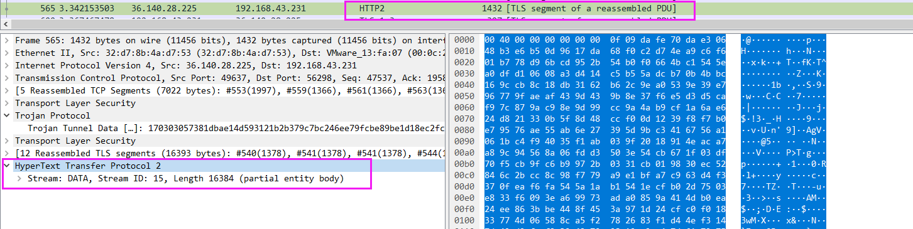

### 代码问题

1. 以下代码判断`tvb`第56位的后两位是不是`CRLF`, `if`条件可能不对。【可以判断password是否一致吗？】

```c
/* trojan request packet */
if (tvb_reported_length(tvb) > TROJAN_PASSWORD_LENGTH && tvb_reported_length(tvb) < TROJAN_REQUEST_MAX_LENGTH) { /* Minimum Trojan request length */
    gchar* tmp_crlf = (gchar*)g_malloc((TROJAN_CRLF_LENGTH + 1) * sizeof(gchar));
    tvb_get_raw_bytes_as_string(tvb, TROJAN_PASSWORD_LENGTH, tmp_crlf, (TROJAN_CRLF_LENGTH + 1));
    if (char_array_eq(TROJAN_CRLF, tmp_crlf, TROJAN_CRLF_LENGTH)) {
        dissect_trojan(tvb, pinfo, tree, data);
        g_free(tmp_crlf);
        return true;
    }
    g_free(tmp_crlf);
}
```

2. `dissect_trojan_heur_tls` 和`dissect_trojan`函数实现相似，冗余
3. `dissect_trojan_request` 中`return`什么数据

```c
second_crlf_pos = tvb_find_crlf_pos(tvb_new_subset_remaining(tvb, offset));
if (second_crlf_pos) {
    proto_tree_add_item(trojan_tree, hf_trojan_dst_addr, tvb, offset + 1, second_crlf_pos - TROJAN_PORT_LENGTH - 1, ENC_BIG_ENDIAN);// 这里为什么+1? trojan文档没写，但实际流量中，这个字节是没用的
    proto_tree_add_item(trojan_tree, hf_trojan_dst_port, tvb, offset + second_crlf_pos - TROJAN_PORT_LENGTH, TROJAN_PORT_LENGTH, ENC_BIG_ENDIAN);
    proto_tree_add_item(trojan_tree, hf_trojan_crlf, tvb, offset + second_crlf_pos, TROJAN_CRLF_LENGTH, ENC_BIG_ENDIAN);
}

// todo: 后面还有数据吗?

// return offset + second_crlf_pos + TROJAN_CRLF_LENGTH;
return tvb_captured_length(tvb);
```


# Trojan V1.0

## 修改packet-http2.c


## 修改packet-http.c

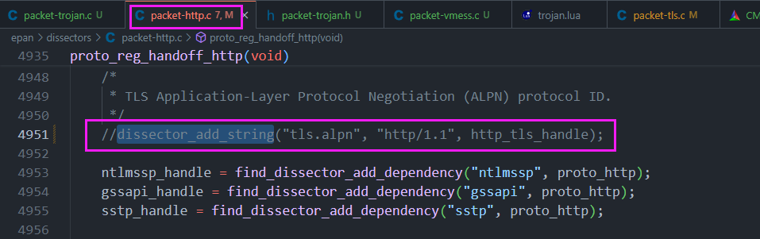


## 目前效果

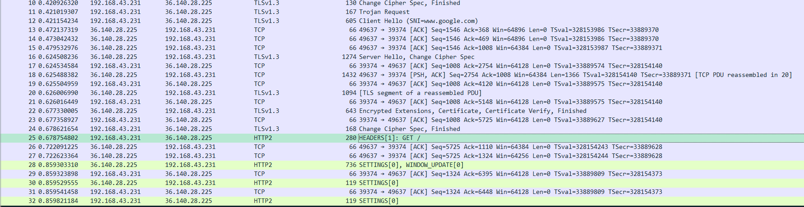

> 代码是demo，写得很乱，先push一版

## todo:

### 1. 陷入trojan循环

使用 `    pinfo->ptype = PT_NONE; `  代码生效后，tls->trojan->trojan 而不是 tls->trojan->http2, 所以后续手动调用了http2的dissector

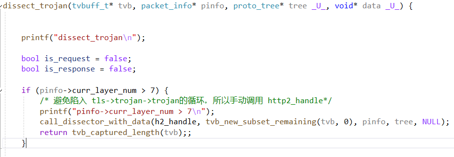

### 2. trojan request 

`dissect_trojan_request` 函数中`hf_trojan_dst_addr`，`hf_trojan_dst_port`还未做解析树。

实现思路：通过两个`CRLF`来定位：`| CRLF | dst_addr | CRLF | dst_port |`

### 3. 解析树显示问题

如下图，显示解码为`Trojan Protocol`但实际调用了`HTTP2_dissector`，应该与本小节`问题1`相关。

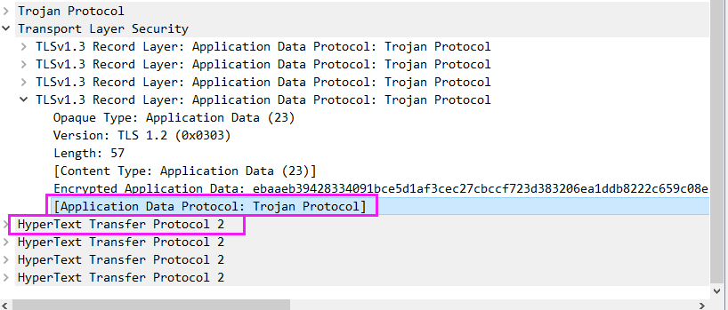


