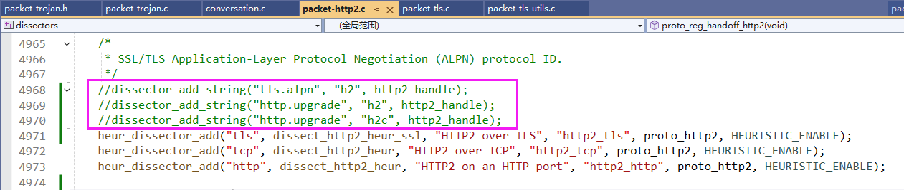
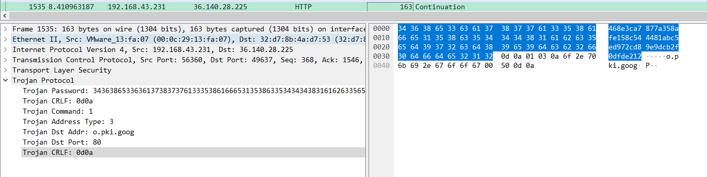
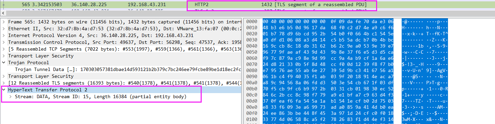
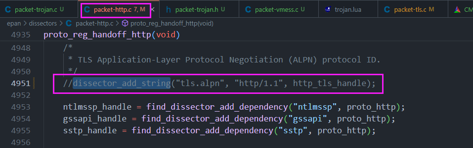

# 2024-10-11 Trojan V2.0

## 第一步：修改packet-http2.c




## 存在问题

### 数据不一致问题 

\#1535，后面的`Info`应该为`Trojan Request` 而不是 `Continuation`,应该和`HTTP.c`中的`dissector_add_string("tls.alpn", "http/1.1", http_tls_handle);` 有关



\#565 后面的`Info`应该为`HTTP`的`Stream`，而不是`reaseembled PDU`



### 代码问题

1. 以下代码判断`tvb`第56位的后两位是不是`CRLF`, `if`条件可能不对。【可以判断password是否一致吗？】

```c
/* trojan request packet */
if (tvb_reported_length(tvb) > TROJAN_PASSWORD_LENGTH && tvb_reported_length(tvb) < TROJAN_REQUEST_MAX_LENGTH) { /* Minimum Trojan request length */
    gchar* tmp_crlf = (gchar*)g_malloc((TROJAN_CRLF_LENGTH + 1) * sizeof(gchar));
    tvb_get_raw_bytes_as_string(tvb, TROJAN_PASSWORD_LENGTH, tmp_crlf, (TROJAN_CRLF_LENGTH + 1));
    if (char_array_eq(TROJAN_CRLF, tmp_crlf, TROJAN_CRLF_LENGTH)) {
        dissect_trojan(tvb, pinfo, tree, data);
        g_free(tmp_crlf);
        return true;
    }
    g_free(tmp_crlf);
}
```

2. `dissect_trojan_heur_tls` 和`dissect_trojan`函数实现相似，冗余
3. `dissect_trojan_request` 中`return`什么数据

```c
second_crlf_pos = tvb_find_crlf_pos(tvb_new_subset_remaining(tvb, offset));
if (second_crlf_pos) {
    proto_tree_add_item(trojan_tree, hf_trojan_dst_addr, tvb, offset + 1, second_crlf_pos - TROJAN_PORT_LENGTH - 1, ENC_BIG_ENDIAN);// 这里为什么+1? trojan文档没写，但实际流量中，这个字节是没用的
    proto_tree_add_item(trojan_tree, hf_trojan_dst_port, tvb, offset + second_crlf_pos - TROJAN_PORT_LENGTH, TROJAN_PORT_LENGTH, ENC_BIG_ENDIAN);
    proto_tree_add_item(trojan_tree, hf_trojan_crlf, tvb, offset + second_crlf_pos, TROJAN_CRLF_LENGTH, ENC_BIG_ENDIAN);
}

// todo: 后面还有数据吗?

// return offset + second_crlf_pos + TROJAN_CRLF_LENGTH;
return tvb_captured_length(tvb);
```


# Trojan V1.0

## 修改packet-http2.c


## 修改packet-http.c




## 目前效果


> 代码是demo，写得很乱，先push一版

## todo:

### 1. 陷入trojan循环

使用 `    pinfo->ptype = PT_NONE; `  代码生效后，tls->trojan->trojan 而不是 tls->trojan->http2, 所以后续手动调用了http2的dissector


### 2. trojan request 

`dissect_trojan_request` 函数中`hf_trojan_dst_addr`，`hf_trojan_dst_port`还未做解析树。

实现思路：通过两个`CRLF`来定位：`| CRLF | dst_addr | CRLF | dst_port |`

### 3. 解析树显示问题

如下图，显示解码为`Trojan Protocol`但实际调用了`HTTP2_dissector`，应该与本小节`问题1`相关。


 


